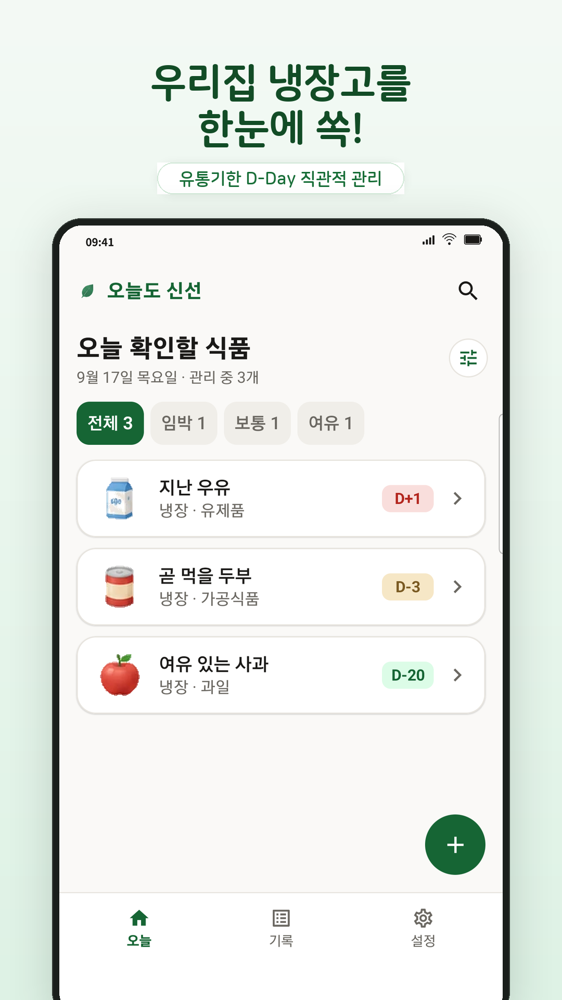
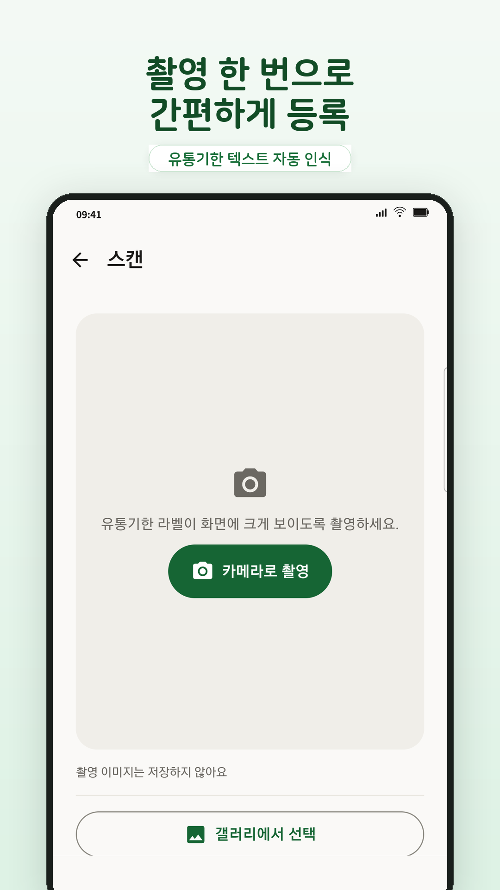
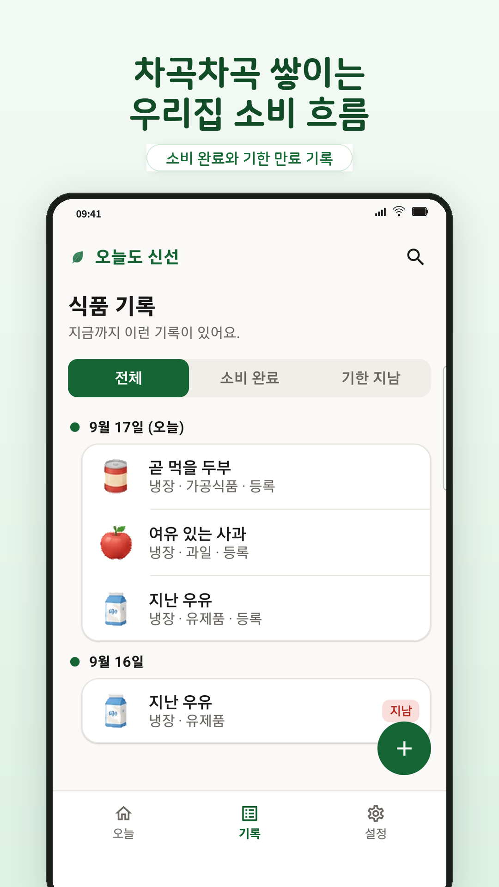

# 오늘도 신선 (Fridge D-Day)

**촬영 한 번으로 유통기한을 등록하고, 데이터는 기기 밖으로 내보내지 않는 Android 앱**

[](https://m.onestore.co.kr/v2/ko-kr/app/0001003331)
[](https://m.onestore.co.kr/v2/ko-kr/app/0001003331)
[](https://kotlinlang.org)
[](#검증된-결과)
[](.github/workflows)

식품 유통기한을 카메라로 찍어 등록하고, 만료 임박 알림과 소비 통계를 제공합니다.
계정도 서버도 없이 **모든 데이터를 기기 안에서만** 처리합니다.
기획·구현·테스트·스토어 등록·운영을 혼자 진행했고, 원스토어에 두 번 배포했습니다.

**[원스토어에서 설치하기](https://m.onestore.co.kr/v2/ko-kr/app/0001003331)**

<p align="center">
  
  
  
</p>

---

## 왜 만들었나

유통기한 관리 앱은 **날짜를 일일이 입력해야 하면 금방 안 쓰게 됩니다.** 그렇다고 계정과 서버를 붙이면
집에 뭐가 있고 무엇을 언제 먹었는지가 통째로 외부로 나갑니다. 편의와 프라이버시가 맞바꿔지는 구조입니다.

이 앱은 둘 다 포기하지 않는 것을 목표로 잡았습니다 — **촬영으로 입력 부담을 없애되, 그 처리를 전부 기기 안에서** 합니다.
그래서 Release APK에는 `INTERNET` 권한 자체가 없습니다.

## 주요 기능

| 기능 | 내용 |
|---|---|
| **OCR 날짜 입력** | CameraX로 촬영 → ML Kit 한국어 OCR로 날짜 후보 추출 → 사용자 확인 후 저장 |
| **유통기한 관리** | 식품명·보관 위치·만료일을 Room DB에 저장, D-Day 상태 표시 |
| **백그라운드 알림** | WorkManager로 만료 임박 항목을 주기 확인해 알림 |
| **소비 통계** | 추가·소비·만료 기록과 보관 위치별 분포 |
| **홈 화면 위젯** | 오늘·내일 만료 항목을 앱 실행 없이 확인 |
| **백업·복원** | 로컬 JSON 내보내기·가져오기 (포맷 v2, v1 하위호환) |

## 설계 판단

### 서버 없는 오프라인 구조

Release APK에 `INTERNET` 권한이 없습니다. 런타임 권한은 카메라와 알림뿐이고, 광고·분석·추적 SDK와 계정 기능을
넣지 않았습니다. 데이터는 Room DB와 DataStore에만 저장됩니다.

이 원칙이 코드에만 있으면 언젠가 깨지므로 **CI가 강제**합니다 — 릴리스 APK에 `INTERNET` 권한이나 비공개 QA 자료가
섞이면 빌드를 실패시킵니다.

### OCR을 신뢰하지 않는 입력 흐름

OCR은 조명·라벨 방향·인쇄 상태에 따라 틀립니다. 그래서 **틀릴 수 있다는 전제로 흐름을 설계**했습니다.
촬영 이미지를 0도와 90도로 각각 분석해 후보를 늘리고, **인식한 날짜는 사용자가 확인해야만 저장됩니다.**
날짜가 확정되지 않으면 저장이 차단되므로, OCR이 틀려도 잘못된 값이 기록으로 남지 않습니다.

### MVVM + Repository

```text
Jetpack Compose UI
        ↓
ViewModel + StateFlow
        ↓
Repository
        ↓
Room DB / DataStore
```

UI·상태 관리·데이터 접근을 분리해 화면 로직이 Room 구현에 직접 의존하지 않게 했습니다.

## 기술 스택

| 영역 | 기술 |
|---|---|
| 언어·UI | Kotlin, Jetpack Compose, Material Design 3 |
| 상태·구조 | ViewModel, StateFlow, MVVM, Repository |
| 데이터 | Room, DataStore, `org.json` |
| 백그라운드 | WorkManager, Android Notification |
| 카메라·OCR | CameraX, Google ML Kit Text Recognition |
| 부가 기능 | Glance App Widget, 로컬 JSON 백업·복원 |
| 빌드·품질 | Gradle (Kotlin DSL), GitHub Actions, ProGuard, Target SDK 36 |

## 검증된 결과

**출시**

- 원스토어 배포 2건 (v1.0 → **v1.0.2**, 2026-08-12)
- **원스토어가 재서명한 실제 배포 APK를 직접 검사**해 `INTERNET` 권한 부재와 비공개 QA 자료 미포함을 확인

**품질 게이트**

- 단위 테스트 **29건** — `ExpiryDateParser` 9 · `DateUtils` 7 · `AddEditViewModel` 5 · `DDayState` 3 · `WorkScheduler` 3 · `BackupManager` 2
- 계측 테스트 **15건** — `ItemDao` 6 · `HomeScreen` 4 · `OcrDateConfirmationDialog` 3 · `DatabaseUpdate` 1 · `OcrBenchmark` 1
- 기본 브랜치는 **PR과 CI 통과 없이 머지할 수 없습니다** (force push·삭제 차단)
- Room 파괴적 마이그레이션 제거(`exportSchema = true`). 업데이트 시 **기존 데이터 보존을 계측 테스트가 단언**합니다

**OCR 회귀 측정**

출시 후 **독립 한국 식품 라벨 55장**으로 동일 표본 회귀 환경을 만들고, 인식 로직을 손볼 때마다 같은 55장·같은 평가일 조건으로 재측정했습니다.

| 지표 (D-30 시나리오 기준) | 값 |
|---|---|
| 정확 일치 | 37/55 (67.27%) → **40/55 (72.73%)** |
| 정답 후보 재현 | 43/55 (78.18%) |
| 최대 실패 유형 `wrong_date` | 14건 → **11건** |
| D-180 정확 일치 | 39/55 (70.91%) |

**그리고 이 개선을 배포하지 않았습니다.** 자동화와 회귀 게이트를 전부 통과했지만 D-30 오답 15장이 남았고,
표본에 없는 날짜 형식이 있어 측정하지 못한 구간이 존재했기 때문입니다. 잘못된 유통기한은 사용자가
상한 음식을 먹는 결과로 이어지므로, 측정하지 못한 구간을 괜찮을 것이라 가정하고 내보내지 않았습니다.

**대신 지켜야 할 대상을 다시 정의했습니다.** 인식 정확도가 아니라 *잘못된 날짜가 저장되지 않는 것*입니다.
인식 결과를 사용자가 확인해야 저장되도록 바꿔 **위험 경로 자체를 제거**하고, Room 데이터 보존과 배포 APK 권한을
검증한 뒤 **v1.0.2로 배포**했습니다. 이 과정에서 단위 테스트는 19 → 29건, 계측 테스트는 11 → 15건이 됐습니다.

> 측정 조건·원본 CSV digest·재현 명령은 [OCR 벤치마크](docs/qa/OCR_BENCHMARK.md),
> 문제 → 측정 → 개선 → 회귀 자동화 → 릴리스 판단의 전 과정은
> [품질 기준선과 릴리스 판단 기록](QA_RELEASE_RECORD.md)에 고정했습니다.

## 시작하기

요구사항: Android Studio · JDK 17 · Android SDK 36

```bash
git clone https://github.com/jgjoe/Fridge-D-Day.git
cd Fridge-D-Day
./gradlew assembleDebug
```

품질 게이트 실행:

```bash
./gradlew test lintDebug assembleRelease
```

## 프로젝트 구조

```text
app/src/main/java/app/fridgedday/
├─ data/       Room, DAO, Entity, Repository, DataStore
├─ ui/         Compose 화면과 ViewModel
├─ util/       날짜 계산, OCR, 알림, 백업·복원
├─ worker/     WorkManager 만료 확인
└─ widget/     홈 화면 위젯
```

## 측정 조건과 범위

수치를 정확히 읽기 위한 조건입니다.

- OCR 수치는 **독립 한국 식품 라벨 55장 · 고정 평가일 시나리오** 기준의 회귀 기준선입니다. 실사용 전체 정확도가 아닙니다.
- 평가셋에 한글 `YYYY년 MM월 DD일`, 연속 `YYYYMMDD`·`YYMMDD` 표기와 실제 촬영일 기반 표본이 없어 **해당 형식의 품질은 측정하지 않았습니다.**
- v1.0.2의 확인 단계는 잘못 읽힌 날짜가 **저장되는 것**을 막는 장치이며, 인식 정확도 자체를 올린 변경이 아닙니다.
- 공개 배포 채널은 원스토어입니다. Google Play에는 출시하지 않았습니다.
- 가족 공유·클라우드 동기화는 프라이버시 우선 범위에서 제외한 설계 결정입니다.

## 문서

| 문서 | 내용 |
|---|---|
| [QA_RELEASE_RECORD.md](QA_RELEASE_RECORD.md) | 품질 기준선, 릴리스 판단, v1.0.2 범위와 검증 |
| [docs/qa/OCR_BENCHMARK.md](docs/qa/OCR_BENCHMARK.md) | 측정 조건, CSV digest, 재현 명령 |
| [docs/qa/BETA_TEST.md](docs/qa/BETA_TEST.md) | 베타 테스트 계획과 판단 |

## 만든 사람

**Jigwan Joe** — Android · Backend

- GitHub: [@jgjoe](https://github.com/jgjoe)
- Email: jigwan.joe@gmail.com
